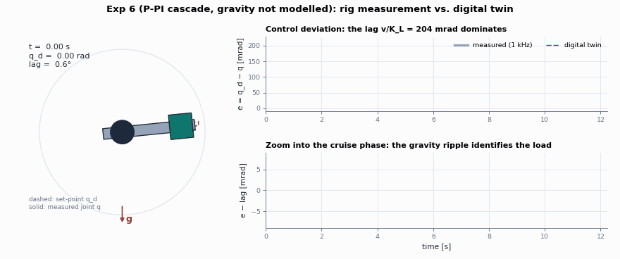
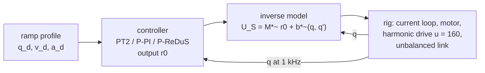
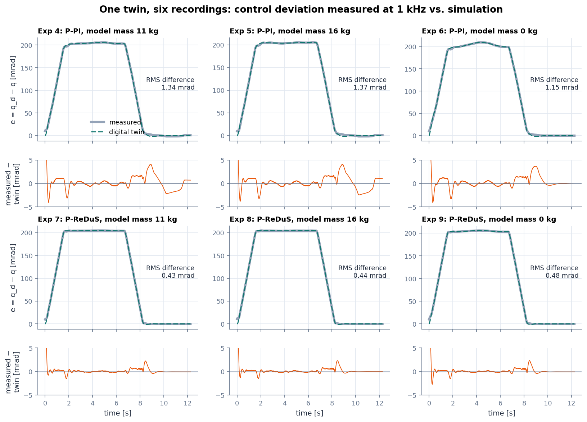
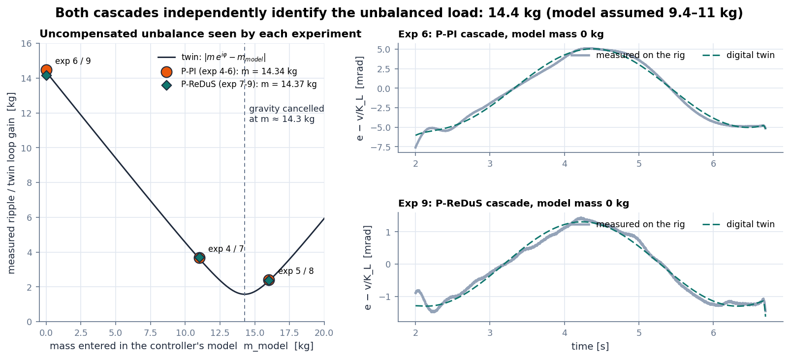
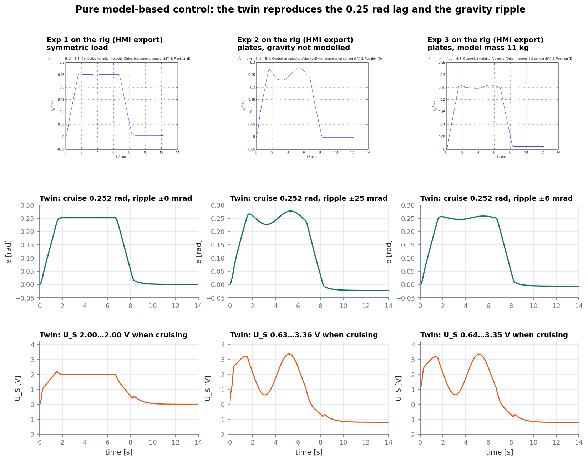
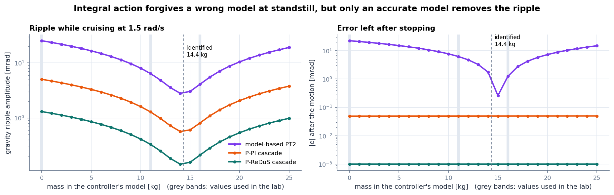
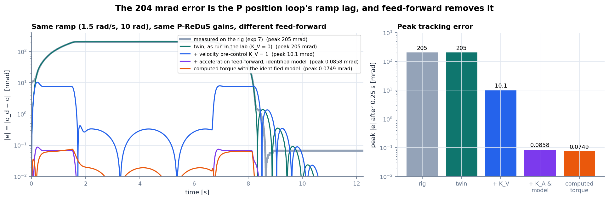
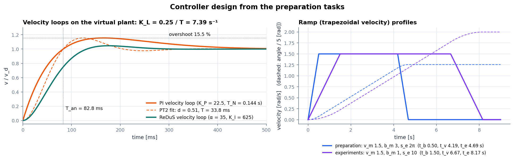

<div align="center">

# harmonic-digital-twin

**A digital twin of a harmonic-drive robot joint under model-based control (computed torque, P-PI and P-ReDuS cascades),
validated against 1 kHz measurements from a real test rig. The once-per-revolution harmonic in its tracking error reveals
the load that was really mounted.**

[](../../actions/workflows/ci.yml)




</div>

This project started as a university lab on model-based control of a single robot joint: joint 3 of a 6-axis arm on a test
stand, with a harmonic drive, a 1 kHz real-time controller and plates that can be bolted on one side of the link. The lab
compared pure model-based control with P-PI and P-ReDuS cascades on top of the model compensation, and changed the mass in
the controller's model to see what happens when the model is wrong.

This repository turns that lab into a **digital twin**: a nonlinear simulation of the rig and all three controllers, checked
against the six recordings exported from the rig. Comparing the twin with the data answers the lab questions with numbers,
reveals the load that was really mounted, and shows what would remove 99.9 % of the tracking error.

The name has three layers: the joint runs through a harmonic drive, the load is identified from the first harmonic of the
tracking error, and the rig lives on as a digital twin.

## Highlights

| | |
| --- | --- |
| **Twin ≈ rig** | Over six 12 s recordings at 1 kHz the twin matches the measured control deviation to 0.43–0.48 mrad RMS (P-ReDuS) and 1.1–1.4 mrad RMS (P-PI), on a signal of about 205 mrad. |
| **The load, identified twice** | The gravity ripple is linear in the mass entered in the model. Both cascades independently put the true unbalanced mass at **14.34 / 14.37 kg** (the model assumed 9.4 kg, and 11 kg was entered), with a 6.3° angle offset. |
| **Where the error comes from** | Every cascade run cruises at exactly $v/K_L = 1.5/7.34 = 204$ mrad. That is the P position loop's ramp lag, not the velocity controller and not the model. |
| **ReDuS vs. PI** | With the same model error, the ReDuS velocity loop leaves 3.9× less gravity ripple than the PI loop (1.3 vs. 5.1 mrad). |
| **The fix** | In the twin, velocity pre-control alone cuts the peak error 20× (205 → 10 mrad); full feed-forward with the identified model reaches 0.09 mrad. |
| **Every prep task as code** | $M^*$, $b^*$, PT2 gains, PI and ReDuS design, the step-response PT2 fit and the ramp timings, each as a tested function. |

## Quick start

```bash
# from the repository root
python -m pip install -e ".[dev]"
python examples/quickstart.py      # prints the numbers below
pytest                             # 36 tests, a few seconds
python examples/make_figures.py    # regenerates everything in docs/media
```

```python
from harmonictwin import LAB_MODEL, LAB_PROFILE, RIG, make_controller, simulate, load_measurements

controller = make_controller("redus", LAB_MODEL.with_(m=11.0))  # the lab's experiment 7
sim = simulate(controller, RIG, LAB_PROFILE)  # twin of the rig, 1 kHz, 12.25 s
data = load_measurements()  # the real recording
print(sim.error.max(), data.error[7].max())  # 0.2047 vs 0.2048 rad
```

<details>
<summary>Output of <code>examples/quickstart.py</code></summary>

```text
M* = 0.3377 V s^2/rad, b* = 0.9245 q' + 0.8881 cos q  [V]
a0 = 156.25, a1 = 25, r0 = -29.375 rad/s^2, U_S = -7.854 V
PI velocity loop  K_P, T_N = (22.5, 0.144)
ReDuS             alpha, beta, K_I = (35.0, 0.0, 625.0)
ramp (prep)       t_b, t_v, t_e = (0.5, 4.1888, 4.6888)
exp (4, 5, 6): unbalanced mass 14.34 kg, gravity offset -6.42 deg
exp (7, 8, 9): unbalanced mass 14.37 kg, gravity offset -6.26 deg
exp 7 twin vs rig: RMS 0.43 mrad
exp 7 with velocity pre-control K_V = 1: peak error 10.4 mrad
```
</details>

## The rig and its controllers



$M^* \ddot q = U_S - b^*(q,\dot q)$ with $M^* = (M + J_A u^2)/(K_M u)$ and $b^* = k_1\dot q + k_2\cos q$. If the controller's
model is right, the rig behaves like the *virtual plant* $\ddot q = r_0$, and simple linear controllers on $r_0$ define the
response. The [theory notes](docs/theory.md) derive all of it.

## Results

### 1. One twin, six recordings



The twin runs the same 1 kHz controllers with the gains taken from the HMI. The rig is modelled as a rigid joint with viscous
and Coulomb friction and the identified unbalance. It reproduces the acceleration, cruise and braking phases of all six runs.
The residual is largest in the first 0.2 s, because the joint starts about 10 mrad off its set-point (static friction at
standstill), and around stopping, where stick-slip that the twin does not model takes over.

### 2. Identifying the load that was really mounted



While the joint cruises at 1.5 rad/s, an imperfectly compensated unbalance shows up as a ripple once per revolution.
Fitting $e = c_0 + c_c\cos q + c_s\sin q$ to the cruise phase gives a phasor $P = c_c - i c_s$. A gravity mismatch enters the
loop linearly, so $P = G\,(m\,e^{i\varphi} - m_{model})$ is a straight line in the mass entered in the controller. Three runs
per controller pin it down:

| | P-PI (exp 4–6) | P-ReDuS (exp 7–9) |
| --- | :-: | :-: |
| unbalanced mass $m$ (at $l_s = 0.4$ m) | **14.34 kg** | **14.37 kg** |
| angle offset of the gravity term $\varphi$ | −6.4° | −6.3° |
| misfit of the straight line | 12 µrad | 11 µrad |

Two different controllers give the same load to 0.2 %. The model in the lab assumed 9.4 kg, and 11 kg was entered at the HMI.
With the identified load, the twin's closed-loop transfer function predicts the measured ripple of every run within
3 % in amplitude and 3° in phase. The fit itself does not use the twin at all.

### 3. Pure model-based control (experiments 1–3)



Only images survive for these runs, so the comparison is visual. The twin reproduces the 0.25 rad cruise lag
($a_1 v/a_0 = 0.24$ rad plus 0.012 rad from friction), the ±25 mrad gravity ripple of experiment 2 including its shape, and the
smaller ±6 mrad ripple once 11 kg are entered. Experiment 1 measured about 2.0 V while cruising, where the lab model predicts
1.39 V. The missing 0.61 V is modelled as Coulomb friction (equivalently $F_M \approx 0.0022$ instead of 0.0015 N m s/rad).

### 4. How much does a wrong model hurt?



Integral action in the cascades makes the *final* error independent of the model. During motion, only an accurate model
removes the ripple: the PT2 controller leaves ±25 mrad with the gravity term missing, the PI cascade 5.1 mrad and the ReDuS
cascade 1.3 mrad. All three are smallest at the identified 14.4 kg, not at the 11 kg used in the lab.

### 5. Closing the gap



The cascades' 204 mrad error is structural: the P position loop only commands a velocity when there is a position error, so
cruising at 1.5 rad/s needs $e = v/K_L$. Feeding the planned velocity into the velocity loop ($K_V = 1$, the "velocity
pre-control" in the lab script) removes that requirement and cuts the peak error 20×. Adding the planned acceleration and using
the identified model brings the twin down to 0.09 mrad, on par with full computed-torque control. On the real rig the
achievable level is bounded by how well the model matches. The twin itself agrees with the rig to 0.4–1.4 mrad RMS.

### 6. Controller design (preparation tasks)



| task | result |
| --- | --- |
| 4.1 model | $M^* = 0.3377$, $b^* = 0.9245\,\dot q + 0.8881\cos q$ (volts) |
| 4.2 PT2 ($T_R = 0.08$ s, $d_R = 1$) | $a_0 = 156.25$, $a_1 = 25$; at $q_d = 1.2$, $q = 1.1$, $\dot q = 1.8$: $r_0 = -29.375$ rad/s², $U_S = -7.854$ V |
| 4.3 PI ($d_{Rv} = 0.9$, $T_{Rv} = 0.08$ s) | $K_P = 22.5$, $T_N = 0.144$ s; exact step: 15.5 % overshoot, $T_{an} = 82.8$ ms → $K_L = 7.39$ s⁻¹ (7.34 on the rig) |
| 5.3 ReDuS ($d_R = 0.7$, $T_R = 0.04$ s) | $\alpha = 35$, $\beta = 0$, $K_I = 625$ |
| 4.4 ramp ($v_m = 1.5$, $b_m = 3$, $s_e = 2\pi$) | $t_b = 0.5$ s, $t_v = 4.189$ s, $t_e = 4.689$ s |

## The lab questions, answered

| question | answer |
| --- | --- |
| Exp 1: is there an error after the motion, and why? | The PT2 law has no integrator, so friction that the model leaves out stays uncompensated. While cruising the lag is $a_1 v/a_0$ = 0.24 rad plus 0.012 rad from friction. |
| Exp 1: $U_S$ at constant velocity vs. eq. 11? | Model 1.39 V, measured about 2.0 V. The extra 0.61 V is friction the model does not contain. |
| Exp 2: what changes with the plates? | Gravity is not compensated: $U_S$ swings between 0.6 and 3.4 V and the error by ±25 mrad, once per revolution. |
| Exp 3: does entering the mass help? | Yes, by 4× (±6 mrad), but not completely: 11 kg is too little. The data says 14.4 kg. |
| Exp 4–6, 7–9: impact of wrong parameters? | No steady-state error in any run (integral action). A wrong mass only adds ripple: 1.3 / 0.84 / 5.1 mrad (PI) and 0.34 / 0.22 / 1.3 mrad (ReDuS) for 11 / 16 / 0 kg. |
| Which controller is best? | ReDuS. Its velocity loop is an exact PT2 and rejects the gravity disturbance 3.9× better. In all cascades the lag $v/K_L$ dominates, though. |
| How to decrease the control error further? | Velocity pre-control ($K_V = 1$): 205 → 10 mrad. Acceleration feed-forward and an identified model reduce it further (0.09 mrad in the twin). |

## Repository layout

```text
harmonic-digital-twin/
├── src/harmonictwin/
│   ├── params.py        # rig parameters, M*, b*, inverse model
│   ├── profile.py       # trapezoidal ramp profile
│   ├── controllers.py   # PT2 model-based, P-PI, P-ReDuS (+ feed-forward), loop transfer functions
│   ├── simulate.py      # 1 kHz controller + RK4 plant simulation
│   ├── design.py        # prep-task formulas, exact LTI step response, PT2 fit
│   ├── identify.py      # ripple phasor and unbalance identification
│   ├── experiments.py   # the nine lab experiments and the identified twin RIG
│   └── data/            # measured control deviation, experiments 4-9 (1 kHz CSV)
├── tests/               # 36 pytest cases, including twin-vs-measurement checks
├── examples/            # one script per figure + quickstart
├── data/                # data description and the HMI plots of experiments 1-3
├── tools/               # extraction of the CSV from the rig's MATLAB figures
├── docs/theory.md       # derivations
├── docs/media/          # generated figures and animation
└── matlab/              # original preparation scripts and Simulink model
```

## Background

[docs/theory.md](docs/theory.md) derives the plant model, the three control laws, the 204 mrad lag and the identification.
[data/README.md](data/README.md) describes the recordings. [`matlab/`](matlab) keeps the original MATLAB preparation scripts
and the Simulink model.

## License

[MIT](LICENSE)
